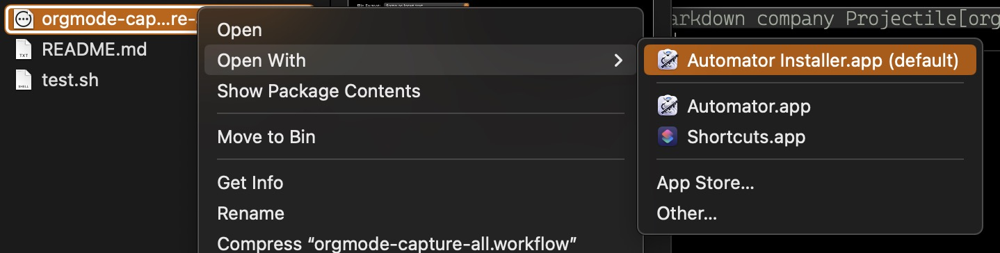
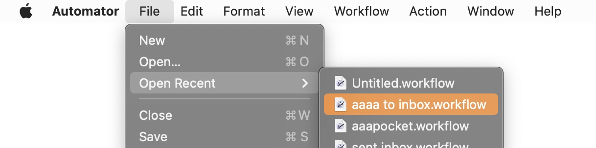
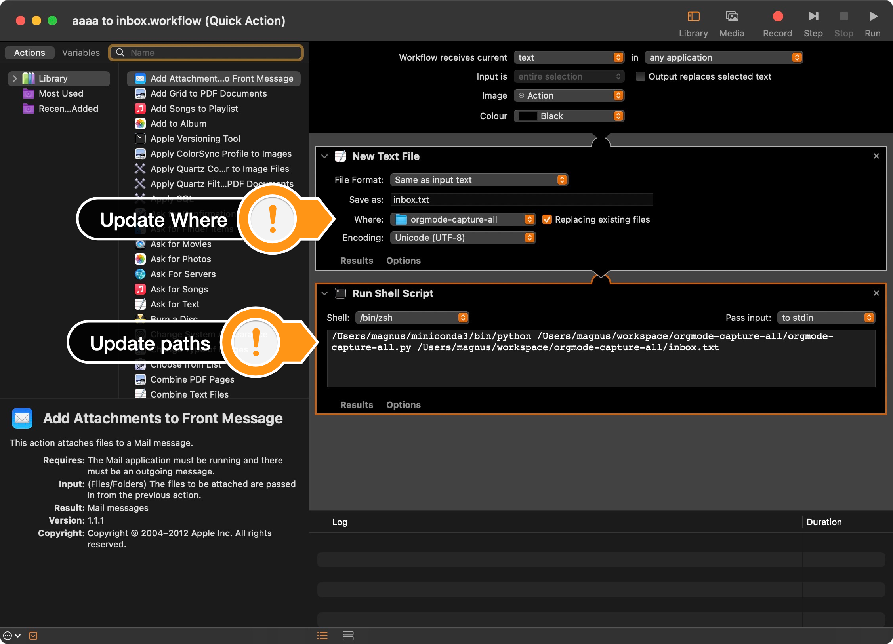

# orgmode-capture-all
Capture ALL (with a right click) to OrgMode Inbox

# Installation & Configuration

- Load orgmode-capture-all.workflow with Automator Installer
- Open Automator.app
- Find the workflow with File -> Open Recents -> aaaa to inbox.workflow
- Edit Where and paths (change zsh shell to bash if required)

